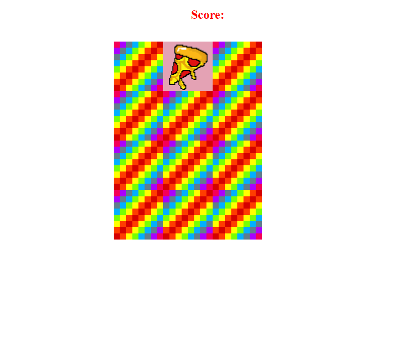

>## Memory Game with Html , Css & Javascript .

<h3>

Hello everyone , In this blog we are going to build a grid game from scratch whose name is **Memory-Game** .

<br>

What does this game do ? It is quite similar to old windows game which many of us had already played , in which we will choose two tiles from a grid and check if the images on both the tile is simillar or not . When we get it simillar we get a point or else we have to try again . 

<br> 

We will be building it from **Html , Css & Javascipt** . 

So , our end product will look something like this : 




Let's just get right into it . We will create a folder with name **Memory-Game**  , inside this folder we will have two folder named as **views** and **images**, inside **views** we have three files named as **index.html** , **style.css** & **app.js** . In **images** we have our images . You can download image from this repo [memory-game-repo](https://github.com/Rahulkumar2002/memory-game). 

In index.html , we will create our boiler plate by <kbd>!</kbd> + <kbd>Enter</kbd> . After that we will link our stylesheet like this in our head tag `<link rel="stylesheeet" href="style.css"></link>` ,  put our title **Memory-Game** in title tag and last work for our head tag will be to link our **app.js** with index.html like this `<script src="./app.js" charset="utf-8"></script>` , with this our head tag is completed . 

Let's move ahead to our body , we will write here  `<h3> Score: <span id="result"></span></h3> ` value of these tag will be given by **Js** in our **app.js** . Below this we will use a <kbd>div</kbd> tag with `class="grid"` similarly like above it's value will also be given in **app.js** . With this our **index.html** is completed and it should look alike this :

```html
<!DOCTYPE html>
<html lang="en">

<link>
<meta charset="UTF-8">
<meta http-equiv="X-UA-Compatible" content="IE=edge">
<meta name="viewport" content="width=device-width, initial-scale=1.0">
<title>Memory-Game</title>
<link rel="stylesheet" href="style.css">
</link>
<script src="./app.js" charset="utf-8"></script>
</head>

<body>
    <h3>Score:<span id="result"></span></h3>

    <div class="grid">

    </div>
</body>

</html>

```
Our next target here will be **app.js** . In **app.js** we want to render our whole game when our site will be loaded , we will put our whole game inside this `document.addEventListener("DOMContentLoaded" , () => {})` . 

To build tiles with images we will create an **Array** named as **cardArray** which will be of type const . Inside this **Array** we will have multiple **Objects** as its elements .In our **Objects** we will create two key value pairs , first one is **name** whose value is simillar to value of images & second one is **img** which will contain location of image corresponding to **name** . Like this : 

<br>

```js
{
   name: 'fries',
   img: '../images/fries.png'
}
```
<br>

For every image tile we will have two **Object** for it in this **cardArray** , because we will be required two simillar tiles to play this game . After creating **Objects** for every image except **blank.png** and **white.png**  , Our **Array** will look something like this .


```js

    const cardArray = [
        {
            name: 'fries',
            img: '../images/fries.png'
        },
        {
            name: 'fries',
            img: '../images/fries.png'
        },
        {
            name: 'cheeseburger',
            img: '../images/cheeseburger.png'
        },
        {
            name: 'cheeseburger',
            img: '../images/cheeseburger.png'
        },
        {
            name: 'pizza',
            img: '../images/pizza.png'
        },
        {
            name: 'pizza',
            img: '../images/pizza.png'
        },
        {
            name: 'hotdog',
            img: '../images/hotdog.png'
        },
        {
            name: 'hotdog',
            img: '../images/hotdog.png'
        },
        {
            name: 'milkshake',
            img: '../images/milkshake.png'
        },
        {
            name: 'milkshake',
            img: '../images/milkshake.png'
        },
        {
            name: 'ice-cream',
            img: '../images/ice-cream.png'
        },
        {
            name: 'ice-cream',
            img: '../images/ice-cream.png'
        }
    ]

```
After creating **Array** for tiles , we will be creating a **createBoard** function to create a tile board for us .

To select our **index.html**  **div with class grid** , I'm gonna use **querySelector** , `const grid = document.querySelector(".grid")` . 

```js
 //creating board
    function createBoard() {
        for (let i = 0; i < cardArray.length; i++) {
            var card = document.createElement('img');
            card.setAttribute('src', '../images/blank.png');
            card.setAttribute('data-id', i);
            card.addEventListener('click', flipcard);
            grid.appendChild(card)
        }
    }
```

This will how our **createBoard** function will look like , I have used a for loop which will run less than length of **cardArray** , to create a image tag inside our  **div with class grid** by `var card = document.createElement('img') ;` , then to set it's attribute `card.setAttribute('data-id' , i) ;` , `card.setAttribute('src' , '../images/blank.png');` , to add an click event listener on to our card `card.addEventListener('click' , flipcard) ;` ,  when someone clicks on our card or tile it will call **flipcard** function and at last we will add our card to our **div with class grid** using appendChild function `grid.appendChild(card);` . 

From this point we will create our **flipcard** function , 

```js

//It is declared above createBoard function for simplicity in completed funciton
  let cardsChosen = [];
   let cardsChosenId = [];

//flipcard function

 function flipcard() {
        let cardId = this.getAttribute('data-id');
        cardsChosen.push(cardArray[cardId].name);
        cardsChosenId.push(cardId);
        this.setAttribute('src', cardArray[cardId].img) ;
        if (cardsChosen.length === 2) {
            setTimeout(checkForMatch, 500)
        }
    }
```
cardId is variable which stores **data-id** attribute of our **card(created in createBoard function)** . We also have created two empty **Array** named as **cardsChosen** & **cardsChosenId** . I know it's looking overwhelming but stick with us , it will all make sense.

We will be adding chosen **cardArray** tile name into **cardsChosen  Array** `cardsChosen.push(cardArray[cardId].name);` & chosen **cardArray** tile id into **cardsChosenId Array** for future use `cardsChosenId.push(cardId);`. To set attribute we will use `this.setAttribute('src' , cardArray[cardId].img) ;` . At the end we will check , how many tile is currently chosen if it is equal to 2 we will call **checkForMatch** function to check if both the chosen tile is same or not according to this we will give points,**setTimeout** will run it every 0.5 sec .

```js
if(cardChosen.lenght === 2) {
    setTimeout(checkForMatch , 500)
}
```

If we are calling **checkForMatch** function then we also have to create it . 

```js

// This will be declared above createBoard function for simplicity

    let resultDisplay = document.querySelector('#result');
    let cardsWon = [];

   //match your card function
    function checkForMatch() {
        const cards = document.querySelectorAll('img')
        const optionOneId = cardsChosenId[0]
        const optionTwoId = cardsChosenId[1]

        if (optionOneId == optionTwoId) {
            cards[optionOneId].setAttribute('src', '../images/blank.png')
            cards[optionTwoId].setAttribute('src', '../images/blank.png')
            alert('You have clicked the same image!')
        }
        else if (cardsChosen[0] === cardsChosen[1]) {
            alert('You found a match')
            cards[optionOneId].setAttribute('src', '../images/white.png')
            cards[optionTwoId].setAttribute('src', '../images/white.png')
            cards[optionOneId].removeEventListener('click', flipcard)
            cards[optionTwoId].removeEventListener('click', flipcard)
            cardsWon.push(cardsChosen)
        } else {
            cards[optionOneId].setAttribute('src', '../images/blank.png')
            cards[optionTwoId].setAttribute('src', '../images/blank.png')
            alert('Sorry, try again')
        }
        cardsChosen = []
        cardsChosenId = []
        resultDisplay.textContent = cardsWon.length
        if (cardsWon.length === cardArray.length / 2) {
            resultDisplay.textContent = 'Congratulations! You found them all!'
        }
    }


```

First of all we are targeting **span with id result** by  `let resultDisplay = document.querySelector('#result')` , after that we will be initializing an array named as **cardsWon**  two store all of the **cardsChosen** element when they will match.
We will be targeting **img** of **cardArray** by `const cards = document.querySelectorAll('img')` , then declaring two variable **optionOneId** as **cardsChosenId[0]** and similarly **optionTwoId** as **cardsChosenId[1]** .After that we will check if we had clicked same image twice by 
```js
if (optionOneId == optionTwoId) {
            cards[optionOneId].setAttribute('src', '../images/blank.png')
            cards[optionTwoId].setAttribute('src', '../images/blank.png')
            alert('You have clicked the same image!')
        }
```
.Then we will check if two chosen tiles is same or not by comparing **cardsChosenId[0]** === **cardsChosenId[1]** , if they will be same then we will setAttribute of both the tiles as **'../images/white.png'** to make simillar tiles as white after checking . Then we will remove event listener from them which is already checked . We will also show and alert when two tile will found simillar .

```js
  else if (cardsChosen[0] === cardsChosen[1]) {
            alert('You found a match')
            cards[optionOneId].setAttribute('src', '../images/white.png')
            cards[optionTwoId].setAttribute('src', '../images/white.png')
            cards[optionOneId].removeEventListener('click', flipcard)
            cards[optionTwoId].removeEventListener('click', flipcard)
            cardsWon.push(cardsChosen)
        }

```

After that we will show sorry try again alert if chosen two tiles is not simillar. 
```js
 else {
            cards[optionOneId].setAttribute('src', '../images/blank.png')
            cards[optionTwoId].setAttribute('src', '../images/blank.png')
            alert('Sorry, try again')
        }
```

Then we will update **cardsChosen array** and **cardsChosenId** as empty for future use . 

```js
cardsChosen = []
cardsChosenId = []

```
At last we will check if all the tiles is checked .

```js
resultDisplay.textContent = cardsWon.length
        if (cardsWon.length === cardArray.length / 2) {
            resultDisplay.textContent = 'Congratulations! You found them all!'
        }
```
Ok so it finalize our **checkForMatch** function.

Then our code will look like for **app.js** as : 
```js

document.addEventListener("DOMContentLoaded", () => {
    //card options :

    const cardArray = [
        {
            name: 'fries',
            img: '../images/fries.png'
        },
        {
            name: 'fries',
            img: '../images/fries.png'
        },
        {
            name: 'cheeseburger',
            img: '../images/cheeseburger.png'
        },
        {
            name: 'cheeseburger',
            img: '../images/cheeseburger.png'
        },
        {
            name: 'pizza',
            img: '../images/pizza.png'
        },
        {
            name: 'pizza',
            img: '../images/pizza.png'
        },
        {
            name: 'hotdog',
            img: '../images/hotdog.png'
        },
        {
            name: 'hotdog',
            img: '../images/hotdog.png'
        },
        {
            name: 'milkshake',
            img: '../images/milkshake.png'
        },
        {
            name: 'milkshake',
            img: '../images/milkshake.png'
        },
        {
            name: 'ice-cream',
            img: '../images/ice-cream.png'
        },
        {
            name: 'ice-cream',
            img: '../images/ice-cream.png'
        }
    ]
    cardArray.sort(() => 0.5 - Math.random())

    const grid = document.querySelector(".grid");
    let resultDisplay = document.querySelector('#result');
    let cardsChosen = [];
    let cardsChosenId = [];
    let cardsWon = [];

    //creating board
    function createBoard() {
        for (let i = 0; i < cardArray.length; i++) {
            var card = document.createElement('img');
            card.setAttribute('src', '../images/blank.png');
            card.setAttribute('data-id', i);
            card.addEventListener('click', flipcard);
            grid.appendChild(card)
        }
    }

    //match your card
    function checkForMatch() {
        const cards = document.querySelectorAll('img')
        const optionOneId = cardsChosenId[0]
        const optionTwoId = cardsChosenId[1]

        if (optionOneId == optionTwoId) {
            cards[optionOneId].setAttribute('src', '../images/blank.png')
            cards[optionTwoId].setAttribute('src', '../images/blank.png')
            alert('You have clicked the same image!')
        }
        else if (cardsChosen[0] === cardsChosen[1]) {
            alert('You found a match')
            cards[optionOneId].setAttribute('src', '../images/white.png')
            cards[optionTwoId].setAttribute('src', '../images/white.png')
            cards[optionOneId].removeEventListener('click', flipcard)
            cards[optionTwoId].removeEventListener('click', flipcard)
            cardsWon.push(cardsChosen)
        } else {
            cards[optionOneId].setAttribute('src', '../images/blank.png')
            cards[optionTwoId].setAttribute('src', '../images/blank.png')
            alert('Sorry, try again')
        }
        cardsChosen = []
        cardsChosenId = []
        resultDisplay.textContent = cardsWon.length
        if (cardsWon.length === cardArray.length / 2) {
            resultDisplay.textContent = 'Congratulations! You found them all!'
        }
    }

    //flip your card 
    function flipcard() {
        let cardId = this.getAttribute('data-id');
        cardsChosen.push(cardArray[cardId].name);
        cardsChosenId.push(cardId);
        this.setAttribute('src', cardArray[cardId].img);
        if (cardsChosen.length === 2) {
            setTimeout(checkForMatch, 500)
        }
    }
    createBoard();

})


```
Let se our final section of **Css** : 

It is simple we had done qutie simple styling to our game . 

```css
*{
    margin: 0px ;
    padding: 0;
    box-sizing : border-box ;
}
.grid{
    display:flex ;
    flex-wrap:wrap ;
    height: 300px;
    width:400px ;
    margin: 10px;
    padding: 10px;
}
body{
    display: flex;
    flex-flow: column;
    align-items: center ;
    justify-content: center ;
}
h3{
    color: red;
    font-size: 25px;
    font-family: serif;
    font-weight: 600;
    margin: 10px;
    padding: 10px ;
    text-align: center;
}

```

Ok this finalize our game .

Thank your for reading it . 

Feel free to fork this repo and play around with code . For more such awesome content follow me .

</h3>
